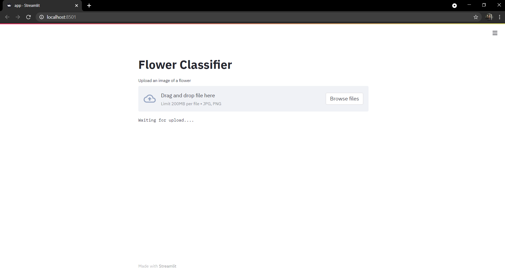
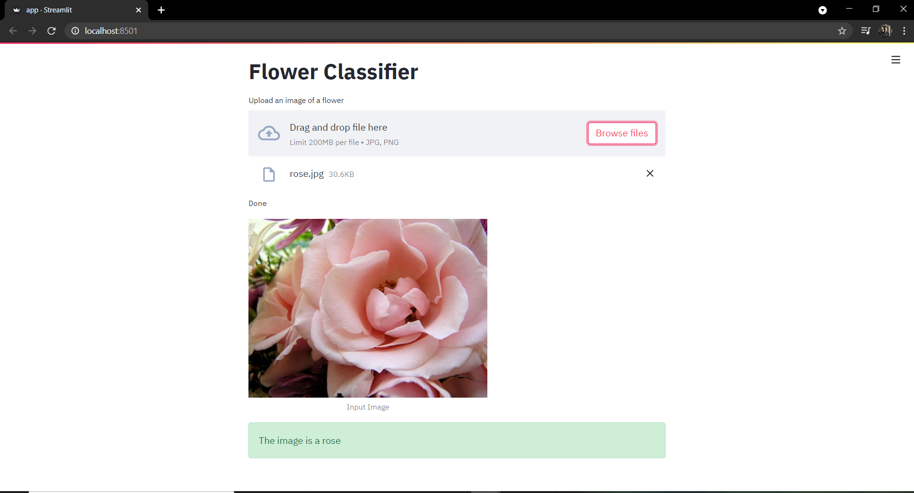

# Image-Classification-Streamlit-TensorFlow
A basic web-app for image classification using Streamlit and TensorFlow.

It classifies the given image of a flower into one of the following five categories :-  
1. Daisy
2. Dandelion
3. Rose
4. Sunflower
5. Tulip

## Commands

To run the app locally, use the following command :-  
`streamlit run app.py`  

The webpage should open in the browser automatically.  
If it doesn't, the local URL would be output in the terminal, just copy it and open it in the browser manually.  
By default, it would be `http://localhost:8501/`  

Click on `Browse files` and choose an image from your computer to upload.  
Once uploaded, the model will perform inference and the output will be displayed.  

## Output

  

## Notes
* A simple flower classification model was trained using TensorFlow.  
* The weights are stored as `flower_model_trained.hdf5`.  
* The code to train the modify and train the model can be found in `model.py`.  
* The web-app created using Streamlit can be found in `app.py`

## References

* https://www.tensorflow.org/tutorials/images/classification
* https://docs.streamlit.io/en/stable/
